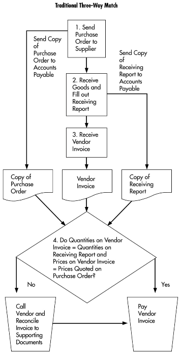

## The Business Activities Cycles

> Prof. Joshua Dennis from Indiana University Bloomington: "The business cycles begin with capturing data/information about a transaction. They end with information output, such as a financial statement or payment (similar to a system). Similar transactions are grouped together to form a business cycles"...."Business Cycles give us a framework for gathering and documenting business requirements or “business rules"

There are 5 major Business Cycles:

1. Procurement cycle (Expense, Purchasing, Procure to Pay)
2. Revenue cycle (Sales, Order to Cash)
3. Production cycle (Manufacturing or Operations)
4. Human Resources / Payroll cycle
5. Accounting Cycle

During the CORE, you would participate in different business activities of these cycles using SAP. Here, I would focus on introducing the **Procurement Cycle** and the **Revenue Cycle**. There are a lot of good resources online that you could find about other three cycles. You are very welcome to dig into them as knowing them would help you better understand business processes in organizations.

------

- ### Procurement Cycle (Procure-to-Pay)

Read about the Procurement Cycle: 

[*Procurement Cycle (The Telegraph)*](https://jobs.telegraph.co.uk/article/procurement-cycle/ )

[*Procurement Management Process - The 2020 Guide (Kissflow)*](https://kissflow.com/procurement-process/)

The above Image Source[^1]

[^1]: This image above is retrieved from a lecture slide deck created by Porf. Joshua Dennis from Indiana University Bloomington for class A400/S337.

From [the Telegraph article](https://jobs.telegraph.co.uk/article/procurement-cycle/ ) above, you could find that there are many important documents that are involved in the procurement cycle. You would find it helpful in the future if you could gain a basic understanding of them right now. They are:

1. Purchase Order: prepared by the **buyer** when ordering goods or services
2. Goods Receipt: prepared by the **buyer** when taking physical possession of goods
3. Invoice / Bill: prepared by the **seller** and sent to the **buyer**
4. Check (Payment): Prepared by the **buyer** and given to the **seller**, usually accompanied by a remittance advice to seller knows where to apply the payment

*Note: You are encouraged to look online for examples of the above documents if you don't know what they might look like.*

------

- ### Sales Cycle (Order-to-Cash)

Read [*"Sales Cycle"* by Skyword](https://trackmaven.com/marketing-dictionary/sales-cycle/#:~:text=The%20sales%20cycle%20is%20the,on%20how%20they%20define%20it.) to learn about Sales Cycle:

> The sales cycle is the process that companies undergo when selling a product to a customer. It encompasses all activities associated with closing sale. Many companies have different steps and activities in their sales cycle, depending on how they define it.

Below are two more detailed websites explaining the stages and documents that are involved. Pay attention again to each step as they would generate documents that are essential for firms:

*[Step by Step: What you Should Know About the Order-to-Cash Process (Salesforce)](https://www.salesforce.com/products/cpq/resources/what-to-know-about-order-to-cash-process/)* 

[*A Walk Through The Order To Cash (O2C) Cycle*](https://www.purchasecontrol.com/blog/order-to-cash-process/)

The above Image Source[^2]

[^2]: This image above is retrieved from https://www.salesforce.com/products/cpq/resources/what-to-know-about-order-to-cash-process/

The documents that are generated from the sales cycle are:

1. Sales Order: typically a reflection of (and response to) the Purchase Order
2. Packing Slip: accompanies the goods and usually omits $ dollar amount as an internal control measure *(pause a second to think here: why does packing slip omit the dollar amount? Do some research!)*
3. Invoice (Bill): Prepared by the **Selling company**
4. Payment Receipt: produced by the **Seller** and/or may be reported on a monthly statement of account.

*Note: You are encouraged to look online for examples of the above documents if you don't know what they might look like.*

------

### Other Business Activities Cycles

There are five business activities cycles that you should understand before entering MSIS program.
>1. Procurement cycle (Expense, Purchasing, Procure to Pay)
>2. Revenue cycle (Sales, Order to Cash)
>3. Production cycle (Manufacturing or Operations)
>4. Human Resources / Payroll cycle
>5. Accounting Cycle
In this page, we have summarized the first two cycles. However, you should read about the other three cycles as you would be doing hands-on practices, labs, and simulation games for the ERP module of MSIS Core.

Refer to these great articles to get familiar with the business cycles that are not described in detail, try to think about how these business activities connect to each other inside an enterprise:

#### Production Cycle:

[*Step by Step: What you Should Know About the Order-to-Cash Process* (Salesforce)](https://help.ordertime.com/help/production-cycle) 

<iframe width="560" height="315" src="https://www.youtube.com/embed/iMwDwtTSSjY" frameborder="0" allow="accelerometer; autoplay; clipboard-write; encrypted-media; gyroscope; picture-in-picture" allowfullscreen></iframe>

##### MRP (Material Requirements Planning) 

This Video does an excellent job on teaching the concepts of MRP. 

<iframe width="560" height="315" src="https://www.youtube.com/embed/Uc2gPR_MiH4" frameborder="0" allow="accelerometer; autoplay; clipboard-write; encrypted-media; gyroscope; picture-in-picture" allowfullscreen></iframe>

#### Human Resources Cycle

Skim this article, *[Human Resources Cycle: Comparison of models](https://www.oxford-review.com/oxford-review-encyclopaedia-terms/human-resources-cycle/)*, should give you a fairly good idea on how HR cycles could be. We will not dig deeply in the HR cycle, but it is smart for you as a future business leader to learn about it.

##### Accounting Cycle

Carefully read [*Accounting Cycle*](https://www.investopedia.com/terms/a/accounting-cycle.asp) on Investopedia, don't forget to watch their embedded video as it would thoroughly walk you through the Accounting Cycle.

------

## Practice Opportunity 1. Global Bikes 

After complete reading the ERP and Business Cycles pages, you should have a fair understanding on how and why business apply ERP systems into their day-to-day operations. 

Most likely, at this point you don't have access to SAP's server yet. But take a look at this [SAP introduction on a company called "Global Bikes"](http://www3.cis.gsu.edu/dtruex/courses/CIS8670/Lectures-pdf/2015/Intro_ERP_Using_GBI_SAP_slides.pdf) You might find it helpful as it is really similar to what we are going to learn in Core.

## Practice Opportunity 2. Documents from the business cycles

Try to jot down as many as possible documents that are involved from the Sales and Procurement cycle.

It would be excellent if you could remember them all. They will definitely serve you well in MRP module of MSIS Core! 

### Practice Opportunity 3. A real SAP Case

 [*From order-to-cash to wall-to-wall: Four SAP implementations at Smithfield Foods"*](https://journals.sagepub.com/doi/10.1177/2043886918819302)

Try to make sense of this case, and tackle the case questions at the end of the case. It is challenging, but challenges are helpful!