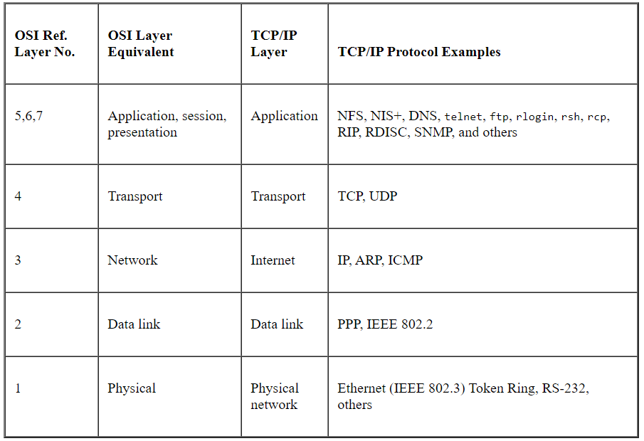

---
authors:
    - Jiaqi Xiao
date: 2021-02-21

---

# Network Model

## During the MSIS program

In MSIS, you would learn difference resources of a network that make internet connectivity, management, business operations and communication possible. From this page, you would be introduced to some basic concepts of network models as well as internet infrastructure to get you prepared for more advanced materials in the future.

## Major Concepts

### Learning Outcome

- [ ] 

### Basic Terms

**Data communication**: movement of computer information by means of electrical or optical transmission systems 

**Telecommunication**: broader than data communication. It includes the transmission of data as well as voice, video, images and graphics and it usually represent the transmission of these elements through long distance.

**Client:** user device that's used to access data from the network

**Server:** device that stores and transmits data to client(s)

**Protocol:** a set of rules that define what the layer will do and that provides a clearly defined set of messages

In the below graphic, the clients are PC, smartphone, and laptop. These components together make up a typical network model called "client-server model".

### Type of Networks

Networks can be categorized by different scope. 

- When we categorize networks using <u>geographic scope</u>, there are three types of networks:

  - **Local Area Network (LAN)**: network that link devices in a small area.

  - **Backbone Network (BN):** network that interconnects networks and provide pathway for them to exchange information.**

  - **Wide Area Network (WAN)**: as its name suggests, WAN covers large areas and connects devices that are far apart. 

  - To understand more about the details and differences between these networks, you can read the following articles:

    [Difference between LAN and WAN (from GeeksforGeeks)](https://www.geeksforgeeks.org/difference-between-lan-and-wan/)

    [LAN vs WAN: What's the Difference? (from Guru99)](https://www.guru99.com/lan-vs-wan.html)

    [Types and Uses of Backbone Networks (from GeeksforGeeks)](https://www.geeksforgeeks.org/types-and-uses-of-backbone-networks/)

- When we categorize networks by different user group, we get two types of networks:
  - **Intranet**: internet technology that is used to share information **within** an organizations.
  - **Extranet:** internet technology that is used to share information **between** organizations.

### Network Layers

As you learned from the previous section, **protocol** is the language of transmission or the rule of device communication.

Read this explanatory article [Protocol](https://techterms.com/definition/protocol) from "TechTerms" if you need to know more about protocol.

**Protocol Data Unit (PDU)**: contains layer-specific information necessary for a message to be transmitted through a network.

**Layers**: network layers is a framework that explains network interactions. There are two different internet models: OSI model and TCP/IP model. They are very similar in concept, but TCP/IP is more concise as it has less layers.

**TCP/IP Model and OSI Model:**

(retrieved from: https://docs.oracle.com/cd/E19683-01/806-4075/ipov-10/index.html

Read the informational articles below to fully understand the internet models and different layers. Keep in mind that there are some advanced technical term you might not know yet, you are encouraged to look those up as they would help you better understand the entire topic more thoroughly.

[The Network Layers Explained [with examples]](https://www.plixer.com/blog/network-layers-explained/)

[CompTIA Network + Microsoft MTA Networking: OIS mode](https://asmed.com/comptia-network-osi-model/)

[TCP/IP Protocal Architecture Model (from Oracle)](https://docs.oracle.com/cd/E19683-01/806-4075/ipov-10/index.html)

It is important to be familiar with the different functionalities of different layers. Please watch the following videos carefully to understand internet layers in details.

//Need to add: How dns work, how ip address work, difference TCP/UDP (by Monday)

//Drake can you help me to make learning objectives and practice questions? 